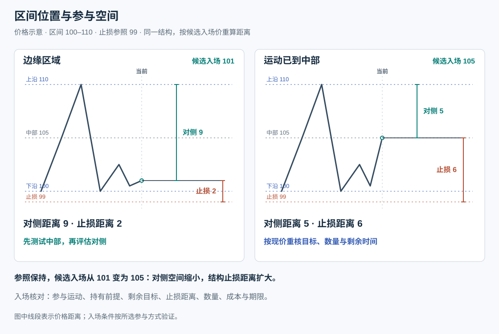
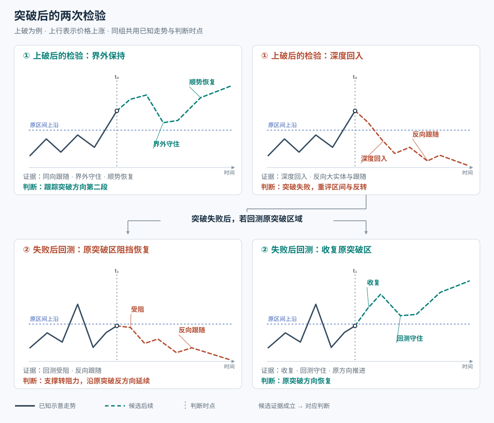
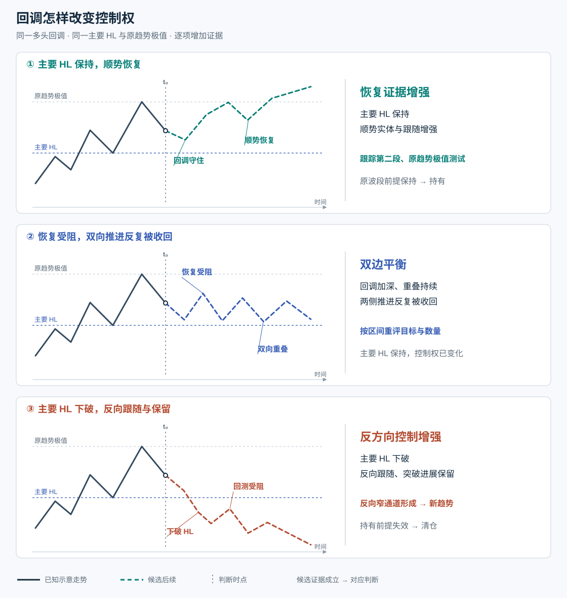
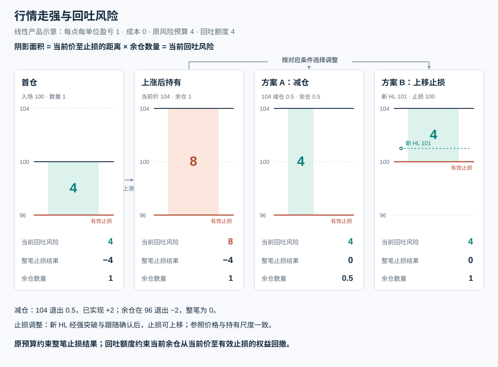
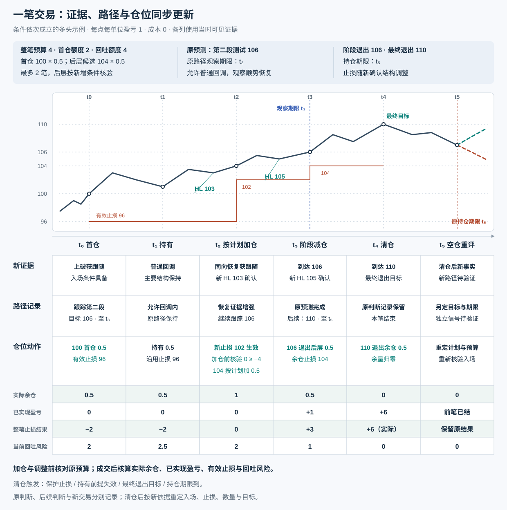

# 条件路径与交易时序

条件对照以上破与多头回调为例：实线为判断时点前的示意走势，虚线为候选后续。各组固定比较位置与尺度；判断随对应证据更新。时序示例逐列记录当时事实、路径与仓位。

## 区间位置与参与空间

固定边界与结构止损，比较候选入场价改变后的剩余目标与止损距离。

## 突破后的两次检验

首次检验突破进展能否保留；失败后的回测检验原突破区域由谁控制。

## 回调与控制权转换

比较主要 HL、回调重叠与恢复力度；沿同一回调分辨原趋势恢复、双边平衡与反向控制。

## 持仓风险

同一上涨段中，原风险预算保持，当前回吐风险随价格、数量与有效止损变化。

## 一笔交易的同步更新

首仓前确定预算、分层与退出计划；每个判断时点同步记录证据、路径、动作与实际风险。原预测按观察期限核验，余仓按持有前提与退出条件管理。

