# 情景决策流程图（Decision Flow）

> **状态：Strategy / Index（覆盖矩阵的视觉投影）**
>
> 本图是 [覆盖矩阵](coverage_matrix.md) 的可视化：每个判定节点标注矩阵行号与 core 权威页，所有路径末端必须是三种叶子之一（STRATEGY / WATCH / NO_TRADE）。

## 运行规则

- 流程顺序固定为：**入口 → 空间硬门槛 → opening 覆盖检查 → 基础状态 → MTR 结构检查 → 晚段形态检查 → continuation/range/breakout 分支 → PREMISE_SELECT → 时段/时间校验（按候选持有期）→ 唯一叶子**；
- 采用**多候选收集模型**：判定节点的多个条件可以同时成立并产生候选集合（如同一回调同时是 H2、double flag 和 wedge pullback）；`PREMISE_SELECT` 按各候选自己的 Trader's Equation 选择唯一 premise；多个候选均通过时，记录交易者明确选择的 premise——方程不自动产生唯一排序；
- `PREMISE_SELECT` 有三个显式出口：至少一个候选通过并明确选择 → 时段校验；证据不足尚不能计算方程 → WATCH；所有候选方程不成立 → NO_TRADE；
- 空间不足（G01；R02/R22 为示例）在入口强制执行；尾盘时间不足（R28）不前置——在 PREMISE_SELECT 之后按所选候选的持有期校验（swing 时间不足 → NO_TRADE；scalp 若仍有足够时间可保留独立计划评估）；
- `WATCH` 是「等待新证据/重新分类」终端：下一次获得新数据时从入口重新运行；**流程图内部不保留无限回边**（MTR 链重置 R34 也落到 WATCH，不画回边）。

```mermaid
flowchart TD
    ENTRY["读图开始（绑定周期与观察窗口，携带持有意图）"] --> GSP{"空间硬门槛（G01；R02/R22 为示例）<br/>core：支撑阻力与目标"}
    GSP -->|"现实目标空间不足"| NG["NO_TRADE：G01 全局优先"]
    GSP -->|"通过"| OPEN{"opening 覆盖检查（R26/R27/R41/R45）<br/>core：周期与时段 Context"}

    OPEN -->|"BOM/压缩方向未决"| S26["STRATEGY：压缩结构双向候选（R26 + Opening BOM 覆盖层 R45）"]
    OPEN -->|"离开 opening-range 边界并获接受"| S41["STRATEGY：开盘区间突破（R41）"]
    OPEN -->|"初始方向失去接受"| OV2{"底层 premise 可判定？（R27）<br/>core：周期与时段 Context"}
    OV2 -->|"证据不足，必须等待"| W27["WATCH：等待足以判定底层 premise 的新证据（R27）"]
    OV2 -->|"证据足以分类"| BASE
    OPEN -->|"非 opening 或未触发覆盖"| BASE{"基础状态判定<br/>core：市场周期"}

    BASE -->|"状态不清"| W35["WATCH：core fallback 保守归类（R35）"]
    BASE -->|"trading range（成熟）"| RNG["区间情景（R16–R25）"]
    BASE -->|"trend"| STAGE{"趋势阶段<br/>core：趋势和通道"}

    STAGE --> TR1{"MTR 结构破坏？（通道/趋势线，R29）<br/>core：主要趋势反转"}
    TR1 -->|"是"| TR2{"旧极值测试状态？（R29/R30/R31/R34/R44）"}
    TR2 -->|"测试未决"| W29["WATCH：等待旧极值测试（R29）"]
    TR2 -->|"旧极值被重新接受并获跟进"| W34["WATCH：MTR 证据链重置（R34）"]
    TR2 -->|"测试失败"| TR3{"反向触发？（R30/R31/R44）<br/>core：主要趋势反转"}
    TR3 -->|"尚无反向触发"| W44["WATCH：等待反向触发或强突破（R44）"]
    TR3 -->|"反向触发（breakout 前）"| S30["STRATEGY：MTR 早期版，约 40%（R30）"]
    TR3 -->|"强反向 breakout + follow-through"| S31["STRATEGY：MTR 确认版，约 60%（R31）"]
    TR2 -->|"测试未失败（旧极值守住）"| LATE
    TR1 -->|"否 / 完整链未成立"| LATE{"趋势晚段形态？（R06/R07/R32/R33/R42/R43）<br/>core：逆势修正 Scalp / 主要趋势反转"}

    LATE -->|"wedge 三推 + 合格逆势触发"| S32["STRATEGY：三推楔形反转（R32）"]
    LATE -->|"final flag 顺势失败 + 合格逆势触发"| S33["STRATEGY：最终旗形反转（R33）"]
    LATE -->|"climax 后反向证据 + 合格逆势触发"| S07["STRATEGY：高潮后修正（R07）"]
    LATE -->|"旧极值两次测试失败 + neckline 突破"| S42["STRATEGY：双顶双底反转（R42）"]
    LATE -->|"ET 五腿 + 反向压力 + 确认"| S43["STRATEGY：扩张三角形 MTR 候选（R43）"]
    LATE -->|"无合格逆势触发"| W06["WATCH：等反向证据（R06）"]
    LATE -->|"无晚段形态"| STAGE2{"continuation 分支"}

    STAGE2 -->|"压缩/双向候选（任意语境）"| S26C["STRATEGY：压缩结构双向候选（R26）"]
    STAGE2 -->|"spike"| SPIKE{"突破接受证据<br/>core：突破和突破模式"}
    SPIKE -->|"仅越界"| W05["WATCH：等待接受证据（R05）"]
    SPIKE -->|"首根足够强 breakout bar 收盘，无独立 follow-through"| S36["STRATEGY：收盘跟随早期版（R36）"]
    SPIKE -->|"强 breakout + follow-through，无回踩"| S03["STRATEGY：收盘跟随确认版（R03）"]
    SPIKE -->|"follow-through 后回踩守住"| S04["STRATEGY：突破回踩（R04）"]
    SPIKE -->|"首次浅回调，控制有效"| S01["STRATEGY：第一次小回调（R01）"]
    SPIKE -->|"首破失败 → 反向失败 → 原方向再次突破"| S40["STRATEGY：失败再失败延续（R40）"]
    SPIKE -->|"回调双测试（double flag）"| S37["STRATEGY：双测试旗形（R37）"]
    SPIKE -->|"深回调穿均线 / 长期未触均线首触"| S38["STRATEGY：均线缺口回调（R38）"]
    SPIKE -->|"趋势内三推回调"| S39["STRATEGY：三推楔形回调（R39）"]

    STAGE2 -->|"tight channel"| TC{"通道寿命与晚段证据<br/>core：高潮和状态转换"}
    TC -->|"回调未破坏控制，约 20 根内"| S08["STRATEGY：趋势延续（R08）"]
    TC -->|"约 20 根，无晚段证据"| W09["WATCH：提高晚段风险检查（R09）"]
    TC -->|"约 20 根 + 晚段证据，无 MTR/宽楔形"| W10["WATCH：首逆势约 70% minor（R10）"]
    TC -->|"晚段微型通道"| W11["WATCH：约 70% TBTL（R11）"]
    TC -->|"合格逆势触发（MTR 链未成立）"| S12["STRATEGY：逆势修正 scalp（R12）"]
    TC -->|"endless pullback"| W13["WATCH：重新归类（R13）"]
    TC -->|"回调双测试（double flag）"| S37B["STRATEGY：双测试旗形（R37）"]
    TC -->|"深回调穿均线 / 长期未触均线首触"| S38B["STRATEGY：均线缺口回调（R38）"]
    TC -->|"趋势内三推回调"| S39B["STRATEGY：三推楔形回调（R39）"]

    STAGE2 -->|"broad channel"| BC{"转换证据<br/>core：趋势和通道"}
    BC -->|"回调未破坏控制"| S14["STRATEGY：宽通道参与区（R14）"]
    BC -->|"趋势线破/回调加深"| W15["WATCH：检查旧极值测试（R15）"]

    RNG --> EDGE{"边缘突破尝试<br/>core：交易区间"}
    EDGE -->|"方向未决（压缩，任意时段）"| S26D["STRATEGY：压缩结构双向候选（R26）"]
    EDGE -->|"失败重新入区"| S16["STRATEGY：边缘确认 fade（R16）"]
    EDGE -->|"LOM 环境"| S17["STRATEGY：限价探针（R17）"]
    EDGE -->|"H2/L2 指向内部"| S18["STRATEGY：边缘第二次信号（R18）"]
    EDGE -->|"真空快冲未接受"| S19["STRATEGY：失败突破回归（R19）"]
    EDGE -->|"强 breakout + follow-through，无回踩"| S20["STRATEGY：收盘跟随确认版（R20）"]
    EDGE -->|"follow-through 后回踩守住"| S21["STRATEGY：突破回踩（R21）"]
    EDGE -->|"首破失败 → 反向失败 → 原方向再次突破"| S40B["STRATEGY：失败再失败延续（R40）"]
    EDGE -->|"barbwire 脱离获接受"| S25["STRATEGY：突破延续（R25）"]
    EDGE -->|"区间中部"| N23["NO_TRADE（R23）"]
    EDGE -->|"barbwire 内"| N24["NO_TRADE（R24）"]

    S01 --> PSEL
    S03 --> PSEL
    S04 --> PSEL
    S07 --> PSEL
    S08 --> PSEL
    S12 --> PSEL
    S14 --> PSEL
    S16 --> PSEL
    S17 --> PSEL
    S18 --> PSEL
    S19 --> PSEL
    S20 --> PSEL
    S21 --> PSEL
    S25 --> PSEL
    S26 --> PSEL
    S26C --> PSEL
    S26D --> PSEL
    S30 --> PSEL
    S31 --> PSEL
    S32 --> PSEL
    S33 --> PSEL
    S36 --> PSEL
    S37 --> PSEL
    S37B --> PSEL
    S38 --> PSEL
    S38B --> PSEL
    S39 --> PSEL
    S39B --> PSEL
    S40 --> PSEL
    S40B --> PSEL
    S41 --> PSEL
    S42 --> PSEL
    S43 --> PSEL

    PSEL{"PREMISE_SELECT：候选策略集合 → 单一 premise<br/>按各候选自己的 Trader's Equation 选择（core：概率、风险和回报）"}
    PSEL -->|"≥1 候选通过并明确选择 premise"| SESSION{"时段/时间校验：按所选候选的持有期检查剩余时间（R28）<br/>core：周期与时段 Context"}
    PSEL -->|"证据不足，尚不能计算方程"| T_WATCH
    PSEL -->|"所有候选 Trader's Equation 不成立"| T_NT

    SESSION -->|"持有期时间足够（含 opening、middle，以及仍有足够时间的 late）"| T_STRAT["STRATEGY：进入所选策略页检查六要素，建立 Trade Plan"]
    SESSION -->|"swing 时间不足；scalp 需独立计划评估"| N28B["NO_TRADE：R28"]

    W05 --> T_WATCH
    W06 --> T_WATCH
    W09 --> T_WATCH
    W10 --> T_WATCH
    W11 --> T_WATCH
    W13 --> T_WATCH
    W15 --> T_WATCH
    W27 --> T_WATCH
    W29 --> T_WATCH
    W34 --> T_WATCH
    W35 --> T_WATCH
    W44 --> T_WATCH
    NG --> T_NT
    N23 --> T_NT
    N24 --> T_NT
    N28B --> T_NT

    subgraph 终端
        T_STRAT["STRATEGY：按所选策略页建立 Trade Plan"]
        T_WATCH["WATCH：等待新证据，从入口重新运行"]
        T_NT["NO_TRADE：显式不交易"]
    end
```

## 可达性检查

- 每个非终端节点至少有一条出边；采用多候选收集模型：判定节点的多个条件可以同时成立并产生候选集合，由 `PREMISE_SELECT` 的三个显式出口收敛（通过 → 时段校验；证据不足 → WATCH；方程不成立 → NO_TRADE），不存在无出口的候选；
- 所有路径最终落在三种终端之一；每个 WATCH 节点都有入边（R29 由 TR2 的「测试未决」进入，R44 由 TR3 的「尚无反向触发」进入，R34 由 TR2 的「重新接受」进入，R27 由 OV2 的「证据不足」进入）；
- 空间不足（G01；R02/R22 示例）在入口强制执行；尾盘时间不足（R28）在 PREMISE_SELECT 之后按所选候选的持有期校验，不提前阻止仍有时间完成的 range/minor scalp；
- MTR 链（R29–R31/R34/R44）与晚段形态（R06/R07/R12/R32/R33/R42/R43）互不依赖：晚段形态不要求先有通道/趋势线破坏，完整链成立时优先按 MTR；
- R26/R37–R39/R40 的矩阵适用状态在流程中均有对应入口：压缩结构可从 opening（R45 叠加）、EDGE（区间语境）与 STAGE2（趋势语境）进入；double flag/MAG/wedge pullback 在 spike 与 tight channel 均有分支；failed-failure 在 spike 与区间 EDGE 均有分支；
- `WATCH` 终端允许带"所需证据清单"回到入口，但流程图中不画回边——重新运行是下一次读图，不是同一轮内的循环。

## 相关来源

- [覆盖矩阵](coverage_matrix.md)（行号 R01–R45、全局行 G01 与课程核验列）
- [策略目录入口](README.md)
