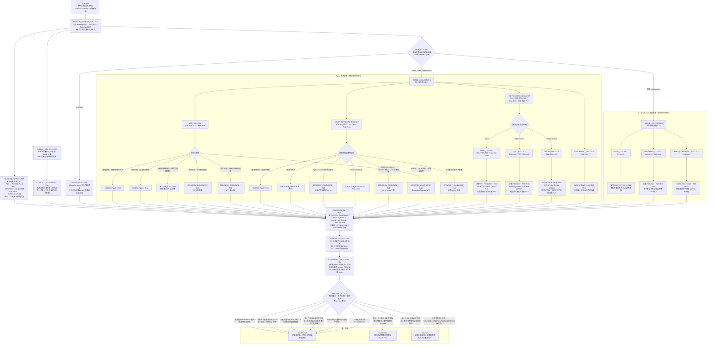

# 情景决策流程图（Decision Flow）

> **状态：Strategy / Index（覆盖矩阵的候选收集投影）**
>
> 本图是[覆盖矩阵](coverage_matrix.md)的可视化。它不是要求执行者在每个节点只选一条出边的互斥决策树，而是对同一价格快照运行多个候选收集器，再经同家族精度消歧、候选级时段过滤和跨 premise 选择，最终输出唯一叶子。

## 运行规则

固定顺序为：

```text
绑定周期与观察窗口
    ↓
收集 session / opening 覆盖信息（只叠加，不替代基础状态）
    ↓
并行收集全局 Breakout Mode（跨基础状态叠加）
    ↓
判定基础状态与趋势阶段
    ↓
在同一快照上运行适用的候选收集器
    ↓
同家族精度消歧（命名子型优先，通用兜底最后承接）
    ↓
按每个候选自己的持有期执行 R28 时间过滤
    ↓
PREMISE_SELECT（跨 premise 裁决）
    ↓
STRATEGY / WATCH / NO_TRADE
```

候选收集器的输出分为四类：

| 输出 | 含义 | 是否参与最终选择 |
| --- | --- | --- |
| `STRATEGY_CANDIDATE` | 证据完整的策略候选 | 先经同家族精度消歧，再进入 PSEL |
| `WATCH_FLAG` | 某项候选仍缺少什么证据，或需要重新分类 | 无完整 STRATEGY 时可成为 WATCH 终端；不能压过已完整策略 |
| `HARD_NO_TRADE` | 对当前候选或位置生效的硬回避约束 | 先过滤其适用范围内的候选 |
| `CHECKPOINT` | 晚段风险、概率或管理提示 | 只附着于保留下来的策略，不产生独立叶子 |

这些输出可以同时存在。例如趋势线破坏但旧极值测试未完成时，可以收集 `R29 WATCH_FLAG`；若同一快照另有完整的趋势延续候选，R29 只记录“MTR 尚未完成”，不能把整轮提前终止为 WATCH。

## 执行者步骤

1. **绑定观察尺度**：写明交易周期、外层 Context、当前观察窗口和预期持有方式；不同周期各自分类，不能把局部状态覆盖外层状态。
2. **收集覆盖信息**：记录 opening、Opening BOM、Opening Reversal、Trend from the Open 和 late-session 等信息。它们只增加候选来源与时段约束，之后仍须进入基础状态分类。
3. **收集跨层 BOM**：Breakout Mode 可以叠加在任意基础状态上；只有尚无一侧获得足以排除另一侧的持续接受，且双向候选的边界、触发、失效和空间均可声明时，才收集 R26。R45 只增加 opening 约束。
4. **判定基础状态**：先区分 trend / trading range；trend 再区分 spike / tight channel / broad channel。状态不清时以 trading range 作为管理假设并产生 R35 WATCH；这不授权尚未成熟的 range fade，也不得截断已经成立的 R26。
5. **运行适用收集器**：trend 同时检查 MTR、minor reversal、continuation 与状态检查点；成熟 trading range 同时检查 fade、breakout 与硬回避约束。一个行情可以命中多个收集器。
6. **同家族精度消歧**：同一母命题下，命名子型完整成立时移除通用兜底；只有没有更具体子型时才保留 R47、R48 等兜底。这个步骤只选“用哪一页描述同一 premise”，不在不同 premise 之间选方向。
7. **逐候选校验 R28**：每个完整候选先用自己的 entry、stop、target 和持有方式检查剩余时间；拒绝时间不足的 swing，但保留已经独立建立且时间足够的 scalp。
8. **PSEL 跨 premise 裁决**：先应用候选相关硬约束和 G01，再检查每个候选是否至少有两个相互补充、没有重复计票的理由，并记录当前最有力的 opposing evidence 与 update condition；独立理由或必要触发不足时输出 WATCH，premise 已否定时输出 NO_TRADE。其后再检查时间合格候选各自的 Trader's Equation；多个不同 premise 均通过时，必须记录明确选择理由。无法给出不依赖结果的选择理由时输出 WATCH / NO_TRADE。
9. **建立 Trade Plan**：按[策略入口的执行清单](README.md#执行清单从策略页到-trade-plan)实例化 supporting reasons、opposing evidence、update condition、具体 entry、active protective stop、target、仓位和管理。

## 候选收集与裁决图



## 裁决细则

### 1. 覆盖层不参与基础状态竞争

- Opening BOM（R45）叠加到通用 Breakout Mode（R26）；
- Opening Reversal（R27）只记录早段语境和缺失证据，证据足够后仍路由到 range fade、MTR 或 minor reversal；
- Opening-range breakout（R41）只有在明确边界外获得接受后才成为突破策略候选；
- Trend from the Open（R46）叠加于 R01、R03 或 R47；
- late-session 信息在候选各自绑定持有期后执行 R28；它过滤候选，不提前全局否决，也不等最终选定后才首次检查。

### 2. 同家族精度消歧

同一母命题下只保留最准确的策略页：

| 母命题 | 优先顺序 |
| --- | --- |
| 趋势延续 | R01 / R08 / R14 / R37–R39 等命名子型 → 无子型才用 R47 |
| 逆势修正 | R07 / R32 / R33 / R42 等命名子型 → 无子型才用 R48；tight-channel 路由 R12 仍按具体结构二次判定 |
| 区间 fade | R17 / R18 / R19 等命名进入方式 → 无更具体子型才使用 R16 通用确认 fade |
| 突破延续 | 按实际风险承担时点选择 BTC/STC、breakout pullback、failed failure 或 opening-range breakout；这些是不同版本/事件，不由通用兜底覆盖 |
| MTR | R30 / R31 表示早期/确认风险时点；R43 是合格 ET 子型。双顶/双底只有完整链成立时才作为 R30/R31 的结构证据，不完整时由 R42 按 minor scalp 承接 |

精度消歧不会改变方向、概率或 premise，也不会把一个候选的有利参数借给另一个候选。

### 3. WATCH 不提前截断完整策略

WATCH_FLAG 说明某个候选仍未完成。例如：

- R29 只说明 MTR 尚缺旧极值测试；
- R34 只说明旧 MTR 证据链已经重置；
- R06 只说明高潮后尚无合格逆势触发；
- R15 只说明 broad channel 出现 transition evidence；
- R05 只说明该 breakout attempt 尚未获得接受。

如果同一快照存在另一个完整 STRATEGY_CANDIDATE，PSEL 仍先检查完整策略；只有没有完整策略时，WATCH_FLAG 才输出 WATCH。

### 4. 硬 NO_TRADE 必须限定适用范围

R23 与 R24 过滤发生在区间中部或 barbwire 内的候选，不能自动否决发生在其他位置、其他周期或已明确脱离该结构的候选。G01 只有在当前所有可识别候选各自的现实 target 空间都不足时才成立。

## 可达性与一致性检查

- Mermaid 的主干是 `OVERLAY → SESSION/GLOBAL_BOM + BASE → COLLECTORS → CANDIDATE_SET → SPECIFICITY_RESOLVE → CANDIDATE_TIME_FILTER → PSEL → TERMINAL`；collector 内的分支是候选输出，不表示执行者只能选择一条；
- R01–R48 与 G01 均由 collector、说明表或 PSEL 明确登记；R02、R22 是 G01 示例，不要求独立策略节点；
- R09–R11 永远只作为 CHECKPOINT；
- MTR、minor reversal、continuation 和状态检查点在 trend 中互不截断；
- R26 作为跨层 collector 与 BASE 并行；fade、breakout 和硬约束在成熟 trading range 中并行收集；
- WATCH 是当前快照的终端；新数据到来后从入口重新运行，不在图内保留无限回边。

维护时人工核对矩阵 ID、collector 归属、入口与终端可达性，并用具体行情逐条走查候选能否正确共存和收敛。拓扑完整不等于语义正确；最终判断仍以 Core 定义、Reference 证据和候选自身 Trade Plan 为准。

## 相关来源

- [覆盖矩阵](coverage_matrix.md)（R01–R48、G01）
- [策略目录入口](README.md)
- [Core：市场周期](../core/01_market_cycle/00_market_cycle.md)
- [Core：什么是 Setup](../core/05_setups/00_what_is_a_setup.md)
